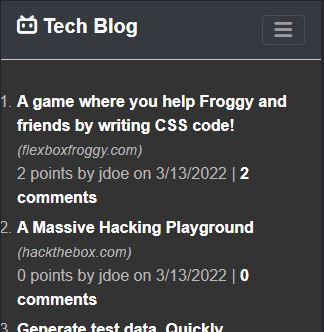

# Tech-Blog

## Overview:

I built the front and back end of a tech blog website using Model-View-Controller (MVC) structure. The application uses Handlebars.js as the templating language, Sequelize as the ORM, and the express-session npm package for authentication. Users can view, create, edit, upvote, and delete blog posts. 

## Technologies Used:

* HTML
* CSS
* Bootstrap
* JavaScript
* Express
* Express-handlebars
* Express-session
* Sequelize
* Connect-session-sequelize
* MySQL2
* Dotenv
* Bcrypt
* Dotenv

## User Story:

AS A developer who writes about tech
I WANT a CMS-style blog site
SO THAT I can publish articles, blog posts, and my thoughts and opinions

## Link to live site:

https://tranquil-wave-47515.herokuapp.com/

